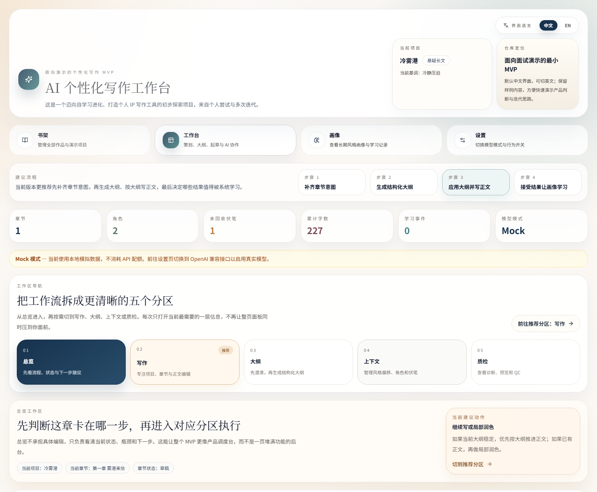

# AI Persona Writing Studio

[中文](./README.md) | [English](./README.en.md)

> A Chinese-first AI writing MVP.  
> It does not try to win on feature breadth. It tries to validate a more specific product belief: an AI writing tool should not behave like it is meeting the writer for the first time on every prompt. It should improve through a loop of generate -> accept -> learn -> generate again.



## 30-Second Overview

| Dimension | Summary |
| --- | --- |
| Problem | Generic AI writing tools can generate text, but they usually do not really remember the writer |
| Product thesis | Accepted output should become a reusable signal for later generations |
| MVP scope | writing -> outline clarification -> generation -> acceptance -> learning -> generation again |
| Current form | a local-first Web app that is stable to demo, Chinese-first, and switchable to English |

## Project Philosophy

This repository explores a self-learning writing tool that helps users build a recognizable personal IP.

It is based on multiple rounds of practical experimentation and iteration. The goal is not only to generate text, but to accumulate preference memory, help users build a more recognizable creative identity, and gradually become a more personal creative partner over time.

The focus is not "one more wrapper around a model endpoint," but a more product-shaped set of questions:

- would writers value a tool that progressively remembers their style
- should accepted output become a durable signal for future generations
- can that loop be demonstrated clearly without heavy infrastructure

## Project Value And Discussion Points

- product judgment takes priority over feature accumulation
- the scope is intentionally narrow, so the full loop can be explained quickly
- it includes UI, server behavior, and persistence, so it reads like a real shipped slice rather than a static mock
- it keeps a clear evolution path without overstating what version one can do
- it creates room for trade-off discussion: why auth, databases, collaboration, a complex CMS, and a training pipeline are still out of scope

## What This Public Version Contains

This repository is the public Web edition of the project, organized for public review, collaboration, and quick demos.

- The main product lives in `ui/`, built with Next.js App Router.
- The app includes `Bookshelf`, `Workbench`, `Profile`, and `Settings`.
- The repository landing page is Chinese-first, while the app UI supports both Chinese and English.
- The workbench has been restructured into five clearer sections: `Overview / Writing / Outline / Context / Review`.
- The backend uses Next.js API routes plus local JSON storage for easy local execution and explanation.
- A `mock` mode keeps the demo stable even without real model credentials.

## The Core MVP Loop

1. The user creates a project and writes inside a chapter.
2. The system clarifies the outline before jumping into generation.
3. AI generates draft, continuation, polish, summary, or diagnosis output.
4. Once the user accepts useful output, the system extracts preference signals from the before/after delta.
5. The user profile is updated and reused in later prompts.

This loop is the center of the current version and the main reason the scope stays compact.

## Recommended Reading Order

1. [README.md](./README.md)  
   Start with the product thesis, MVP boundary, and positioning.
2. [ARCHITECTURE.md](./ARCHITECTURE.md)  
   Then review the learning loop, storage decisions, heuristic trade-offs, and evolution path.
3. [DEMO_SCRIPT.md](./DEMO_SCRIPT.md)  
   Finally read the 5-8 minute walkthrough to understand how the product is meant to be shown.

## Scope Decisions

### Included In The Current Version

- persistent persona memory
- learning from accepted output
- multi-round outline clarification
- project-level style overlays
- local QC and banned phrase controls
- Chinese-first UI with English toggle
- a stable `mock` mode for demos

### Deliberately Out Of Scope For Now

- authentication
- cloud database infrastructure
- multiplayer collaboration
- a heavy content management backend
- a real model training pipeline
- a broader platform layer

The current goal is not to behave like a platform v1. It is to make one product belief legible, testable, and easy to discuss.

## MCP Status

This repository is currently a Web app, not a standalone MCP server.

That said, it already has a sensible path toward MCP:

- the server logic is already separated into reusable local services
- the API surface already covers `generate / analyze / outline / profile / learn`
- the right next step would be exposing MCP tools on top of the same service layer, not rewriting the logic twice

If the project evolves in that direction, likely MCP-facing tools would include:

- `generate`
- `generate-outline`
- `get-profile`
- `learn-profile`

## Core Features

- persistent user profile with controllable persona injection
- auto-learning from accepted AI output, plus manual learning input
- Chinese-first interface with switchable English UI
- project-level style overlay for genre, tone, audience, and writing constraints
- multi-round outline workflow before full chapter generation
- local QC checks and banned phrase controls
- dual runtime mode: `mock` and `openai-compatible`

## Tech Stack

- Next.js 14
- React 18
- TypeScript
- Zustand
- Tailwind CSS
- Vitest

## Local Development

From the repository root:

```bash
npm run setup
npm run dev
```

Then open [http://localhost:3000](http://localhost:3000).

## Build And Test

Production check:

```bash
npm run build
npm run start
```

Tests:

```bash
npm run test:run
```

## Environment Variables

Real model calls are optional. Without `ui/.env`, the app runs in `mock` mode automatically.

To enable an OpenAI-compatible provider:

1. Copy `ui/.env.example` to `ui/.env`
2. Fill in your own credentials

The example uses a DashScope-style endpoint, but the implementation is designed around OpenAI-compatible chat completions APIs in general.

## Project Structure

```text
.
|- ui/
|  |- src/app/               # App Router pages and API routes
|  |- src/components/        # Product UI
|  |- src/lib/               # types, state, QC, client requests
|  \- src/lib/server/        # AI runtime, profile service, local storage
|- DEMO_SCRIPT.md            # 5-8 minute walkthrough
|- INSTALL.md                # setup notes
\- ARCHITECTURE.md           # design notes and evolution path
```

## API Surface

The current Web app exposes a small but complete local API:

- `GET/POST /api/settings/model`
- `GET/POST /api/profile`
- `POST /api/profile/learn`
- `GET /api/profile/learning-history`
- `POST /api/profile/undo`
- `POST /api/ai/generate`
- `POST /api/ai/analyze`
- `POST /api/ai/outline`

## More Detail

- [INSTALL.md](./INSTALL.md)
- [DEMO_SCRIPT.md](./DEMO_SCRIPT.md)
- [ARCHITECTURE.md](./ARCHITECTURE.md)

## License

MIT. See [LICENSE](./LICENSE).
